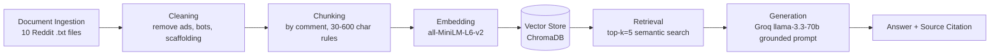

# Project 1 Planning: The Unofficial Guide

> Write this document before you write any pipeline code.
> Your spec and architecture diagram are what you'll use to direct AI tools (Claude, Copilot, etc.) to generate your implementation — the more specific they are, the more useful the generated code will be.
> Update the Retrieval Approach and Chunking Strategy sections if you change your approach during implementation.
> Update this file before starting any stretch features.

---

## Domain

The domain I chose is UCF off-campus student housing. My knowledge base is built from Reddit discussions, apartment reviews, and student experiences about housing options near the University of Central Florida, including communities such as Knights Circle, Mercury 3100, Plaza on University, The Hub, The Aves, Tivoli, Northgate Lakes, Accolade, and others.

This knowledge is valuable because students frequently need information about apartment quality, management responsiveness, bug and mold issues, safety, shuttle reliability, parking, noise levels, roommate experiences, and overall living conditions. While apartment websites provide information about floor plans, amenities, pricing, and marketing materials, they rarely discuss the day-to-day experiences that students care about most.

This information is difficult to find through official channels because apartment management companies generally do not publish negative feedback, maintenance problems, recurring complaints, or comparisons with competing housing options. Instead, students often rely on community discussions and personal experiences shared on platforms such as Reddit. By collecting and organizing these discussions into a retrieval-augmented generation (RAG) system, users can quickly find answers based on real student experiences rather than marketing materials.

---

## Documents

<!-- List your specific sources: URLs, subreddit names, forum threads, or file descriptions.
     Aim for at least 10 sources that together cover different subtopics or perspectives within your domain. -->

| # | Source | Description | URL or location |
|---|--------|-------------|-----------------|
| 1 | r/UCF – "Off campus student housing?" | Discussion of 3x3 apartments under $1000/month, including recommendations for Orion on Orpington, Knights Circle, Tivoli, Campus Crossings, and warnings about Northgate Lakes. | https://www.reddit.com/r/ucf/comments/1r26j8e/off_campus_student_housing/ |
| 2 | r/UCF – "Best off-campus housing?" | Discussion comparing The Lofts, Plaza on University, Knights Circle, The Verge, The Quad, Northgate Lakes, and Accolade. Includes student experiences regarding maintenance, bugs, parking, noise, amenities, and apartment quality. | https://www.reddit.com/r/ucf/comments/1e7dmvz/best_offcampus_housing/ |
| 3 | r/UCF – "good off-campus apartments for under $1100 a month?" | Discussion of affordable student housing options including Mercury 3100, Tivoli, The Hub, Riverwind, Accolade, Eastmar Commons, and renting rooms in houses near UCF. Includes student opinions on pricing, apartment quality, and availability. | https://www.reddit.com/r/ucf/comments/1cyjuti/good_offcampus_apartments_for_under_1100_a_month/ |
| 4 | r/UCF – "UCF Off-Campus Housing" | Discussion about safe housing options near UCF and Valencia, including Plaza on University, Knights Circle, Vale East, Tivoli, Boardwalk, Campus Crossings, and housing shortages around UCF. Includes student and parent perspectives on safety, pricing, parking, and lease timing. | https://www.reddit.com/r/ucf/comments/wakpw4/ucf_offcampus_housing/ |
| 5 | r/UCF – "Best Off-Campus housing w/ no car?" | Discussion focused on housing options for students without vehicles, comparing Knights Circle, Northgate Lakes, Orion on Orpington, The Aves, The Lofts, and Knightshade. Includes experiences with shuttle systems, biking, walkability, grocery access, and transportation to downtown UCF classes. | https://www.reddit.com/r/ucf/comments/17wu3wl/best_offcampus_housing_w_no_car/ |
| 6 | r/UCF – "Which off campus housing should I move in?" | Comparison of Mercury 3100, The Lofts, and The Hub, with additional discussion of Plaza, Accolade, Tivoli, Northgate Lakes, and bug, maintenance, safety, parking, and management concerns. | https://www.reddit.com/r/ucf/comments/1kohehb/which_off_campus_housing_should_i_move_in/ |
| 7 | r/UCF – "Best 'not too modern looking' off campus near UCF?" | Discussion of non-luxury apartment options including Mercury 3100, The Lofts, Village at Science Drive, Northgate Lakes, Tivoli, Accolade, Lark, Verge, and Knights Circle. Includes student opinions on mold, internet reliability, management quality, apartment condition, and pricing. | https://www.reddit.com/r/ucf/comments/1hz8vtr/best_not_too_modern_looking_off_campus_near_ucf/ |
| 8 | r/UCF – "Is off-campus housing really that bad / should I go through with signing a lease?" | Discussion about whether negative apartment reviews accurately reflect student housing near UCF. Includes experiences with Plaza on University, Knights Circle, Orion on Orpington, College Station, The Pointe, and Village at Science Drive, along with discussions of roommates, maintenance, bugs, management quality, and lease decisions. | https://www.reddit.com/r/ucf/comments/kq046u/is_offcampus_housing_really_that_bad_should_i_go/ |
| 9 | r/UCF – "Off campus housing" | Discussion about affordable off-campus housing near UCF for students without cars. Includes recommendations for The Lofts, Pointe at Central, Campus Crossings, Boardwalk, Arden Villas, Tivoli, and College Station, along with advice about UCF shuttle reliability, transportation, utilities, and housing costs. | https://www.reddit.com/r/ucf/comments/1tzgl6l/off_campus_housing/ |
| 10 | r/UCF – "WHICH DO I CHOOSE" | Discussion comparing Knights Circle, Accolade East, Orion on Orpington, The Pointe, Tivoli, Northgate Lakes, and Village at Science Drive. Includes student experiences regarding maintenance, bugs, roommate matching, pricing, safety, management responsiveness, and overall apartment quality. | https://www.reddit.com/r/ucf/comments/1t6n7es/which_do_i_choose/ |

---

## Chunking Strategy

<!-- How will you split documents into chunks?
     State your chunk size (in tokens or characters), overlap size, and explain why those
     numbers fit the structure of your documents.
     A review-heavy corpus warrants different chunking than a long FAQ. -->

**Chunk size:**
Variable — one Reddit comment per chunk. Comments under about 30 characters will be dropped or merged with the parent comment when they only make sense in context. Comments longer than about 600 characters will be split into smaller paragraph-based chunks.

**Overlap:**
0 characters for normal comment-based chunks. For long comments that must be split, I will use about 100 characters of overlap.

**Reasoning:**
My documents are Reddit threads, so the natural unit of meaning is an individual comment. Most comments contain one student’s complete opinion, recommendation, warning, or experience about a specific apartment complex. Splitting by comment keeps apartment names, complaints, pricing details, shuttle information, and recommendations together.

A fixed character split could cut through the middle of a useful review or combine unrelated comments about different apartments into one chunk. However, pure comment-splitting also has problems. Very short comments like “yes” or “1000 each?” do not contain enough meaning to be useful retrieval chunks, so I will drop them or merge them with the surrounding context. Very long comments can contain several separate issues, so I will split those by paragraph with a small overlap. 

For normal comment chunks, I do not need overlap because each comment is already a semantic boundary. Overlap is only needed when a long comment is split, so that apartment names and details are not separated across chunk boundaries.

---

## Retrieval Approach

<!-- Which embedding model are you using (e.g., all-MiniLM-L6-v2 via sentence-transformers)?
     How many chunks will you retrieve per query (top-k)?
     If you were deploying this for real users and cost wasn't a constraint, what tradeoffs
     would you weigh in choosing a different embedding model — context length, multilingual
     support, accuracy on domain-specific text, latency? -->

**Embedding model:**
all-MiniLM-L6-v2 via the Sentence Transformers library.

**Top-k:**
5

**Production tradeoff reflection:**
I selected all-MiniLM-L6-v2 because it is a lightweight, well-established embedding model that runs locally, requires no API costs, and provides strong semantic search performance for short text such as Reddit comments. Its 256-token input limit is not a concern for this project because my comment-based chunks are relatively short, but it would be a limitation for longer document collections. I will retrieve the top 5 most relevant chunks for each query because my chunks are small and opinion-based. Retrieving fewer chunks could miss important student experiences, while retrieving too many could introduce irrelevant apartment discussions and reduce answer quality.

If this system were deployed for real users and cost was not a constraint, I would evaluate larger embedding models that provide stronger semantic understanding and retrieval accuracy. A larger model may better capture housing-specific concepts such as individual leasing, shuttle access, apartment layouts, and maintenance issues. However, these improvements come with increased latency, memory requirements, and computational costs. I would also consider multilingual support since UCF serves a diverse student population, but retrieval accuracy for housing-related discussions would remain the highest priority when selecting a production embedding model.

---

## Evaluation Plan

<!-- List your 5 test questions with their expected correct answers.
     Questions should be specific enough that you can judge whether the system's response
     is right or wrong. "What are good dining halls?" is too vague.
     "What do students say about wait times at [dining hall name] during lunch?" is testable. -->

| # | Question | Expected answer |
|---|----------|-----------------|
| 1 | Which apartment complex is most commonly recommended for students without a car? | Knights Circle is the most frequently recommended option because of its proximity to campus, shuttle access, and walkability. |
| 2 | What concerns do students commonly mention about Northgate Lakes? | Students mention mold issues, unreliable internet, small rooms, dirty units, and maintenance concerns. |
| 3 | Which apartment complexes are frequently described as affordable options under approximately $1,100 per month? | Tivoli, Mercury 3100, Riverwind, College Station, and some units at Orion on Orpington are commonly mentioned as affordable options. |
| 4 | What do students say about living at Plaza on University? | Students praise the location and walkability but frequently mention noise, parking issues, maintenance problems, elevator problems, and pest concerns. |
| 5 | Is Knights Circle or Accolade better for a student who wants a quiet apartment? | The documents discuss Knights Circle and Accolade separately, but they do not provide a clear head-to-head comparison specifically about quietness. A correct response should say there is not enough evidence to confidently choose one based only on quietness. |

---

## Anticipated Challenges

<!-- What could go wrong? Name at least two specific risks with reasoning.
     Consider: noisy or inconsistent documents, missing source attribution, off-topic
     retrieval, chunks that split key information across boundaries. -->

1. Noisy and contradictory reviews. Reddit users often have very different experiences at the same apartment complex. One student may describe a property as clean and well-managed, while another reports bugs, maintenance issues, or poor management. The retrieval system may return conflicting chunks, making it difficult for the language model to provide a single clear answer.

2. Off-topic or incomplete retrieval. Apartment names, amenities, and housing terms are often discussed across multiple threads. A query about one apartment may retrieve comments that mention a different complex or lack enough context to fully answer the question. Additionally, very short comments may not contain enough information for useful retrieval, while long comments may contain multiple topics that need to be separated correctly.

---

## Architecture

---

## AI Tool Plan

<!-- For each part of the pipeline below, describe:
     - Which AI tool you plan to use (Claude, Copilot, ChatGPT, etc.)
     - What you'll give it as input (which sections of this planning.md, which requirements)
     - What you expect it to produce
     - How you'll verify the output matches your spec

     "I'll use AI to help me code" is not a plan.
     "I'll give Claude my Chunking Strategy section and ask it to implement chunk_text()
     with my specified chunk size and overlap" is a plan. -->

**Milestone 3 — Ingestion and chunking:**
Tool: Claude

Input: my Documents section (10 Reddit .txt files in documents/) and my Chunking Strategy section (comment-based splitting, ~30-character floor, ~600-character cap, 0 overlap)

Expect it to produce: a script that loads all 10 files, strips Reddit boilerplate (ads, AutoModerator, vote scaffolding), splits by comment with my length rules, and attaches source filename metadata to each chunk.

Verify: print 5 sample chunks and check they are clean, self-contained, and not fragments or HTML; confirm the total chunk count is reasonable (not fewer than 50 or greater than 2000).

**Milestone 4 — Embedding and retrieval:**
Tool: Claude

Input: my Retrieval Approach section and Architecture diagram.

Expect: code that embeds chunks with all-MiniLM-L6-v2, stores them in ChromaDB with source metadata, and a retrieval function returning the top 5 chunks with distance scores.

Verify: run 3 evaluation questions and check that returned chunks are relevant to the query and that distance scores are reasonably low (approximately below 0.5 for strong matches).

**Milestone 5 — Generation and interface:**
Tool: Claude

Input: my grounding requirement (answer only from retrieved context, cite sources, and respond with “I don't have enough information” when evidence is missing) and the provided Gradio skeleton.

Expect: code that connects retrieval to Groq llama-3.3-70b using a grounding prompt, includes programmatic source attribution, and provides a Gradio user interface.

Verify: test an out-of-scope question and confirm the system refuses rather than hallucinating; verify every generated answer includes source citations to the retrieved documents.
